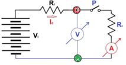
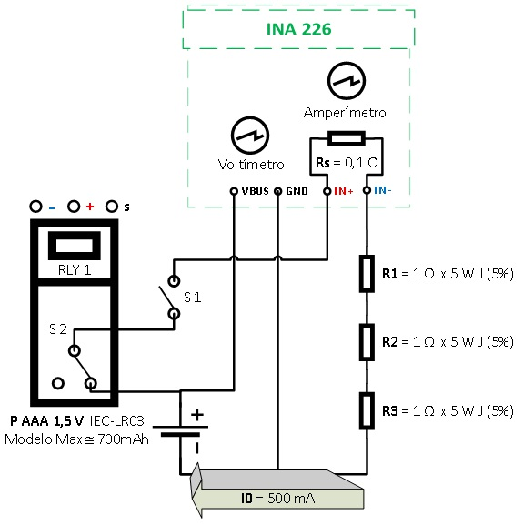
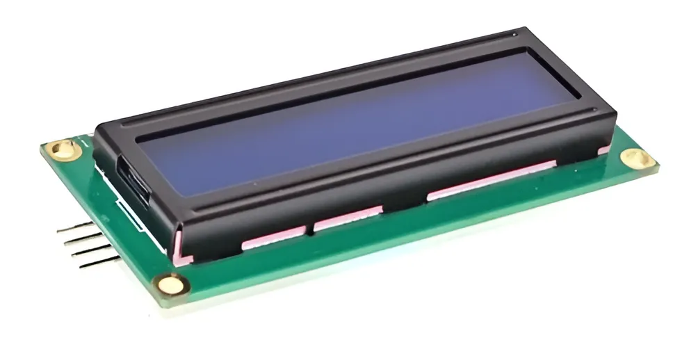
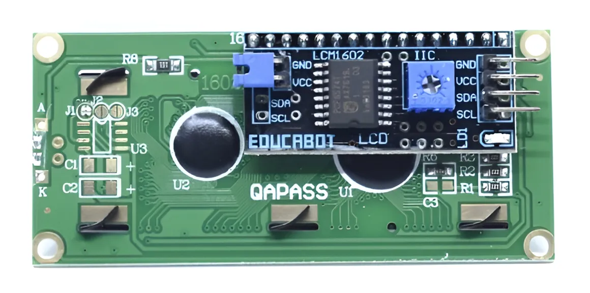
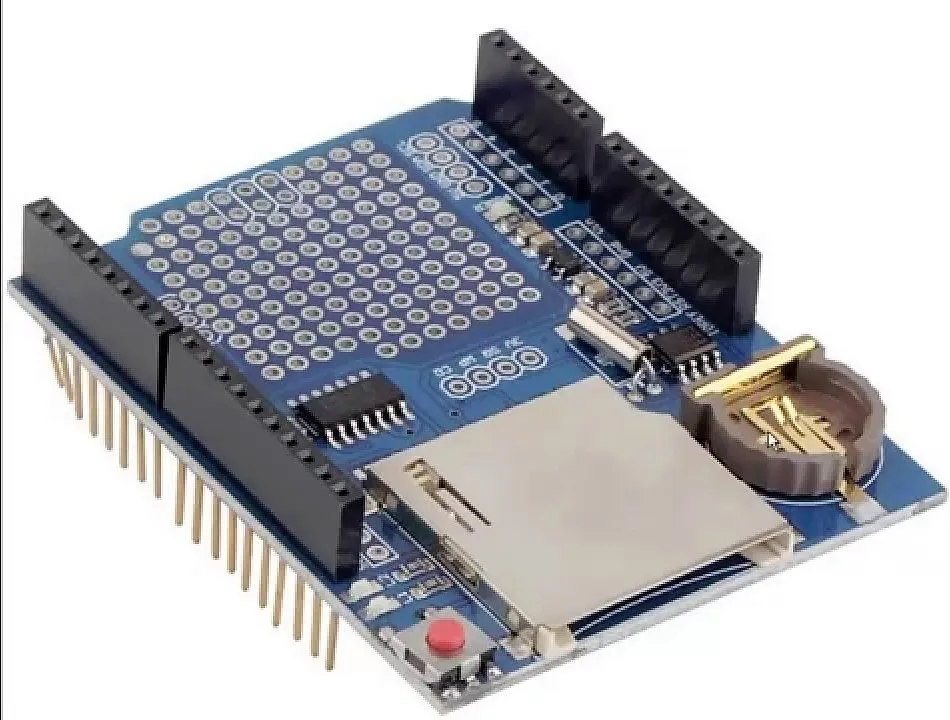
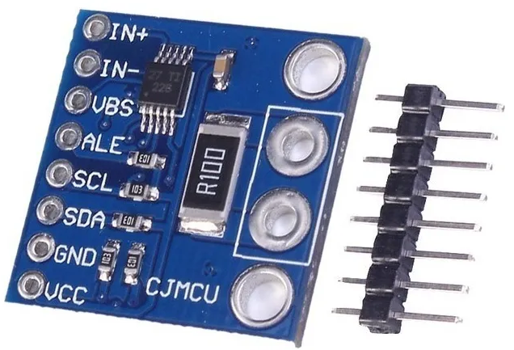
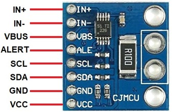
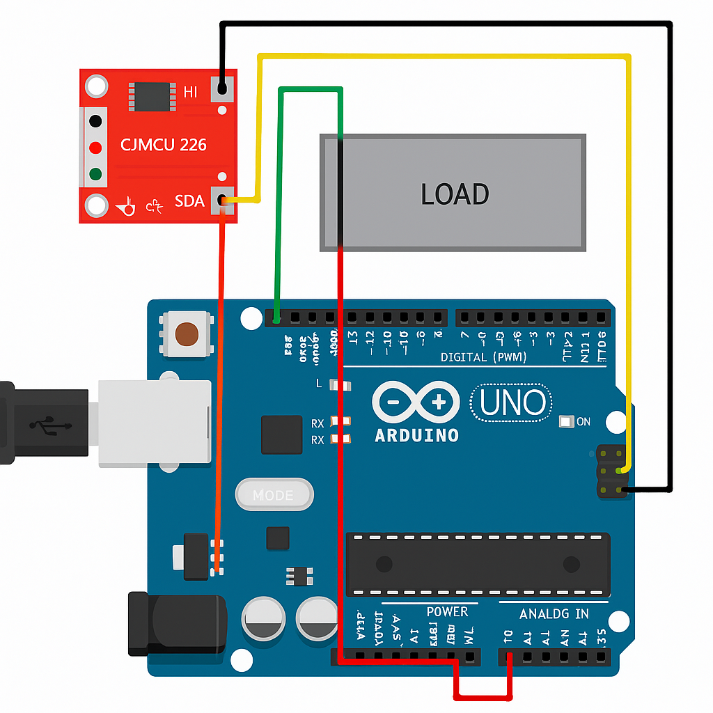

# Laboratorio de Automotores:
<div align="center">
  
</div>

# Medidor de corriente potencia y tensión por I2C con CJMCU-226 / INA226:
**Institución:** FIE Facultad de Ingeniería del Ejército "Grl Div Manuel N. Savio"  
**Autor:** Prof. Ing. Gerhard E.RAITH  
**Fecha:** 12/11/20225
**Versión:** 1.5  *(salida LCD, datos archivo CSV y relé medición)* 
**Idioma:** Español / Inglés  

---
---

## Descripción técnica:

### === Versión: 1.5 ===  
Este sistema permite la medición de corriente, tensión y potencia mediante el módulo CJMCU-226 basado en el chip INA226 de Texas Instruments. La comunicación del módulo **INA226**, el display **LCD 16 x 2** y el reloj en tiempo real **RTC DS1307** se realizan por protocolo **I2C** con una placa Arduino Uno.
El sistema se diseñó para adaptar monitoreos energéticos en dispositivos eléctricos de laboratorio.


En este caso en particular, se aplica a la descarga de una pila, registrando la corriente y la tensión de descarga de acuerdo a la RL *(resistencia de carga)*. Así se obtienen las curvas de tensión [V] potencia [W] e intensidad [A] respecto del tiempo [t]. Con ello la idea es analizar la energía que es capaz de suministrar la pila, para una determinada profundidad de descarga **DoD**.
<p align="center">

</p>
<p align="center">

</p>

#### 🧩 Objetivo:
Activar un módulo de relé después de 10 minutos de medición activa, mantenerlo encendido durante 1.5 minutos, y luego apagarlo. Todo controlado con `millis()`. En todo momento medir la Tensión [V]. Ello permitirá determianr la resistencia interna aparente de la fuente *(en este caso la pila probada)*
#### 🧩 Condiciones de Ensayo Norma IEC 60086:
- **Temperatura ambiente:** típicamente 20 ± 2 [°C].
- **Humedad relativa:** alrededor de 65 ± 20 [%].
- **Descarga continua o intermitente:** depende del tipo de pila y aplicación simulada. *(LR03 / FR03 / R03)*
- **Carga aplicada:** se especifica mediante una resistencia estándar *(por ejemplo, 3,9 Ω para AA, 15 Ω para AAA, etc.)* o una corriente fija.
- **Tensión de corte:** normalmente 0,9 V por celda para alcalinas, aunque puede variar según la química.
- **Número de muestras:** se ensayan varias pilas para obtener un promedio estadísticamente válido.


### 📡 Visualización de datos por puerto serie:
- Interfaz: USB entre Arduino y PC
- Velocidad de transmisión: 9600 baudios
- Herramientas compatibles:
  - PlatformIO Serial Monitor
  - Arduino IDE Serial Monitor
  - PuTTY / RealTerm / CoolTerm
- Intervalo de actualización: cada 10 [s] *(⚙️ Configurable)*
- Datos mostrados:
  - tiempo [s]
  - Tensión [V]
  - Corriente [mA]
  - Potencia [mW]  
  - Relé [0-1]: 0 or 1 *(estado del relé 0 = Apagado, 1 = Encendido)*
### 📄 Exportación de datos en formato CSV:
- Formato: `Tiempo [s],Tension [V],Corriente [mA],Potencia [mW],Rele 1=activo 0=apagado` *(Encabezado)*
- Separador: coma `,`
- Precisión:
  - Tensión: 3 decimales
  - Corriente: 3 decimales
  - Potencia: 2 decimales
- Compatible con: Excel, LibreOffice, Python, MATLAB
- Registro: cada 10 segundos mientras `medicionActiva == true`
### 🖥️ Visualización en LCD 16x2

Durante la medición activa, el sistema actualiza el display LCD con los siguientes datos:

**Línea 1:**
- `V[tensión]` → Tensión medida por INA226, con 3 decimales
- `I[corriente]` → Corriente medida, con 2 decimales
- Espacios de relleno para limpiar residuos visuales

**Línea 2:**
- `P[potencia]` → Potencia calculada, con 2 decimales
- `mW` → Unidad de potencia
- `t[tiempo]` → Tiempo transcurrido desde inicio de medición (en segundos)
- `[estadoRele]` → Estado del relé (1 = activo, 0 = apagado)
- Espacios de relleno para evitar residuos de texto previo

---
---

## 🔧 Hardware utilizado / Hardware Used

Este sistema de medición está basado en una arquitectura modular con los siguientes componentes:

### 🧠 Microcontrolador: Arduino Uno R3
- ES: 8-bit, 16 MHz, 2 KB SRAM, 32 KB Flash. Ideal para sistemas de medición simples.
- EN: 8-bit, 16 MHz, 2 KB SRAM, 32 KB Flash. Suitable for basic measurement systems.

### 📐 Sensor INA226
- ES: Módulo I2C para medición de tensión, corriente y potencia. Dirección típica 0x40.
- EN: I2C module for voltage, current, and power measurement. Typical address 0x40.

### 💾 Módulo SD
- ES: Interfaz SPI. Pin CS = D10. Usa biblioteca SdFat optimizada para trazabilidad.
- EN: SPI interface. CS pin = D10. Uses optimized SdFat library for traceability.

### 📺 LCD 16x2 con I2C (PCF8574)
<p align="center">


</p>
- ES: Dirección típica **0x27**. Visualiza tensión, corriente, potencia y estado del relé.
- EN: Typical address **0x27**. Displays voltage, current, power, and relay status.

### 🔁 Relé 1 canal
<p align="center">

</p>
- ES: Controlado por pin digital. Activa carga externa durante medición.
- EN: Controlled by digital pin. Activates external load during measurement.

### ⚡ Arduino Shield Datalogger con ⏱️ RTC DS1307
<p align="center">

</p>

#### ⚙️ Características principales
- Interfaz para **memoria SD** compatible con FAT32/FAT16 *(niveles de 3.3V)*.
- **RTC DS1307** con batería de respaldo CR1220 *(mantiene la hora por varios años)*.
  -- ES: Reloj de tiempo real con batería, dirección típica **0x68**. Provee fecha/hora para archivos SD y tiempo de medición.
  -- EN: Real-time clock with battery, typical address 0x68. Provides timestamping for SD files and measurement time.
- Área de prototipos para conexiones adicionales.
- LED´s indicadores configurables.
- Referencia de tensión de 3.3V.
- Botón de reset incluido.

### 🔘 Pulsador de inicio
- ES: Lógica activa baja. Inicia ciclo de medición.
- EN: Active-low logic. Starts measurement cycle.
**[ Pulsador ]**
```
┌────┐
│ SW │ (ACTIVO en LOW)
└────┘
|  |
|  └───> Pin digital 2 (Arduino) uso INPUT_PULLUP => High por defecto / 20 a 50 [k]
|
└───> GND 
```
### 🔌 Fuente de alimentación / Power Supply
- ES: 5V regulados. USB o fuente externa.
- EN: Regulated 5V. USB or external source.

---

### 🧭 Notas institucionales / Institutional Notes

- Todos los módulos están conectados sobre protoboard para facilitar pruebas y validación.
- Se recomienda encapsular el sistema en gabinete acrílico para uso prolongado.
- El sistema es escalable para múltiples sensores INA226 en bus I2C compartido.
- La trazabilidad de los datos está garantizada por el RTC y la escritura controlada en SD.

---
---

## Estructura Proyecto / Project Structure:
**MEDIDOR_VIP/**
```
├── **documents/**
│     └── 25.csv (ejemplo adquisición)
│     └── AdafruitDataLoggerShield-EN.pdf
│     └── CircuitoElectrico.vsdx
│     └── INA226_TexasInstrumets-DataSheet-EN.pdf
│     └── INA226_TexasInstrumets-DataSheet-ES.pdf
│     └── ITodoSobreElPuertoI2C.pdf
├── **img/**
│    └── circuito_descarga_INA226.jpg
│    └── circuito_descarga.png
│    └── direcciones-pin_direcciones-esclavas.png
│    └── Displa2x16_D.webp
│    └── Displa2x16_F.webp
│    └── esquema_conexion_ardruino-ina.png
│    └── esquema_interno_cjmcu-226.png
│    └── implementacion_cjmcu-226.png
│    └── INA226-board-1.jpg
│    └── INA226-board.jpg
│    └── modulo-cjmcu-226.png
│    └── Rele.webp
│    └── ShieldDataLogger.webp
├── **include/**
├── **lib/**
│     └── **DS1302/**  (no utilizada en el proyecto)
│     └── **LiquidCrystal_I2C/**
│         └── **examples/**
│            └── **CustomChars/**
│                └── CustomChars.pde
│            └── **HelloWorld/**
│                └── HelloWorld.pde
│            └── **SerialDisplay/**
│                └── SerialDisplay.pde
│         └── keywords.txt
│         └── library.json
│         └── library.properties
│         └── LiquidCrystal_I2C.cpp
│         └── LiquidCrystal_I2C.h
│         └── README.md
├── **src/**
│     └── main.cpp
├── **test/**
│       └── test_DS1307.cpp (Fecha RTC / entorno [env:test_DS1307])
│       └── test_I2C_LCD_USB.cpp (prueba I2C, el LCD y el Bus Serie / entorno [env:test_I2C_LCD_USB])
│       └── test_I2C_scan.cpp (solo escanea I2C / entorno [env:test_I2C])
│       └── test_LCD.cpp (prueba solo LCD con Scroll / entorno [env:test_LCD])
│       └── test_USB.cpp (prueba solo puerto Serie / entorno [env:test_USB])
├── .gitignore
├── LICENSE
├── platformio.ini
├── README.md
```

### 📦 Dependencias gestionadas por PlatformIO:
- Todas las bibliotecas externas *(como `wollewald/INA226_WE@^1.3.0`, `greiman/SdFat @ ^2.2.0` y `makuna/Rtc`)* se instalan automáticamente desde `platformio.ini`.
- Las bibliotecas internas se colocan en la carpeta **/lib/** *(LiquidCristal_I2C)*
- No se versiona la carpeta `.pio/` para mantener el repositorio limpio y reproducible.
- Para compilar: `pio run` *(ejecuta el [env:main])* o abrir con PlatformIO en VS Code.
### 🧪 Validación de entorno PlatformIO:
- Entorno: PlatformIO + VS Code
- Placa: Arduino Uno
- Biblioteca: robtillaart/INA226@^0.6.4 *(desde terminal: pio lib install "robtillaart/INA226")*
- Archivo principal: `src/main.cpp`
- Dependencias gestionadas en `platformio.ini`

### Especificaciones CJMCU-226:
<p align="center">

</p>
<p align="center">


</p>

- Tensión de alimentación: 2,7 a 5,5 [V]
- Consumo de corriente: 350 [µA] *(típico operando)* 2,3 [µA] *(típico reposo)*
- Rango de tensión de bus: 0 a 36 [V] *(medición)*
- Rango de corriente: ± 500 [mA] a ± 50 [A] Dependiendo de la resistencia de derivación *(Shunt)*. *La corriente máxima que puede medir el INA226 no está determinada directamente por el chip en sí, sino por el valor de la resistencia de Shunt utilizada junto con él.*
- ADC: 16 bits
- Modo de medición: continuo o bajo demanda *("activado")*
- Promedio: 1, 4, 64, 128, 256, 512 o 1024 mediciones individuales
- Tiempo de conversión A/D ajustable en ocho niveles: 0,14 a 8,2 [ms]
- Tensión de resolución de Shunt 2,5 [µV]
- Tensión de máxima de Shunt 81,92 [mV]
- Tensión BUS: 1,25 [mV]
- Relación de rechazo modo común: 140 [dB] *(CMR)*
- Compensación máxima : 10 [µV] *(Ofset)*
- Error máximo de ganancia: 0,1 [%]
- Opciones de promedio configurables
- 16 direcciones programables **A0/A1** 0x40 *(predeterminada)* hasta 0x4F
- Informes de corriente, voltaje y potencia
- Pin **ALE** de alarma programable para violaciones de límites y datos disponibles
- Paquete DGS *(VSSOP)* de 10 pines
- Temperatura de funcionamiento: -40 a 125 [°C]

#### PIN OUT CJMCU-226:
1. **VCC:** Tensión de alimentación de 2.7 a 5.5 [V].
2. **GND:** Pin de tierra, conectado a la tierra de la fuente de alimentación.
3. **SDA:** Línea de datos en serie para la interfaz *I2C*. Se utiliza para la transferencia bidireccional de datos.
4. **SCL:** Línea de reloj serie para la interfaz *I2C*. Se utiliza para la sincronización durante la transferencia de datos.
5. **ALE:** Este es el pin de alerta multifunción. Es una salida de drenaje abierto que requiere una resistencia pull-up. Este pin se puede utilizar para varias alertas o como una señal lista para la conversión.
6. **VBUS:** Este pin se utiliza para medir la tensión de alimentación. Puede medir tensión de suministro hasta 36 [V].
7. **IN-:** Este pin se conecta a la carga *(entrada analógica inversora)*. Aquí es donde se coloca la resistencia de derivación para la detección de corriente.
8. **IN+:** Este pin se conecta a la fuente de alimentación*(entrada analógica no inversora) / Resistencia derivadora.
-  **A0/A1:** línea de selección direcciones *I2C*

## Objetivos:
- Medición de tensión de bus *(hasta 36 [V])*
- Medición corriente mediante resistencia shunt
- Calcular potencia instantánea
- Exportar datos por puerto serie para análisis

## Componentes:
- Arduino Uno
- Módulo CJMCU-226 *(INA226)*
- Resistencia shunt de 0.1 [Ω]
- Pila comercial de 1,5 [V]
- Carga (Resistencia para producir la profundidad de descarga objetivo)

## 🔌 CONEXIÓN:
<p align="center">

</p>
- Nota: `hay que actualizar con el conexionado del pulsador de inicio`
### 🔌 Tabla Conexiones eléctricas:

| Componente | Pin terminal |   Arduino Uno  |              Descripción técnica                    |
|------------|--------------|----------------|-----------------------------------------------------|
| CJMCU-226  |      VCC     |       5V       | Alimentación del sensor desde el regulador de 5V    |
| CJMCU-226  |      GND     |       GND      | Tierra común entre sensor y microcontrolador        |
| CJMCU-226  |      SDA     |       A4       | Línea de datos I2C para comunicación bidireccional  |
| CJMCU-226  |      SCL     |       A5       | Línea de reloj I2C para sincronización de datos     |
| CJMCU-226  |      IN+     | Fuente positiva| Entrada de corriente desde la "pila" hacia la carga |
| CJMCU-226  |      IN−     | Carga positiva | Salida hacia el dispositivo bajo prueba *(pila)*    |
|  Pulsador  |       1      |        D2      | Entrada digitasl Nº 2 *(inicio Medición)*           |
|  Pulsador  |       2      |       GND      | Tierra común pulsador y microcontrolador            |

### 🔌 Conexión física del relé:

| Relé Pin | Arduino Uno Pin  | Descripción         |
|----------|------------------|---------------------|
| IN       | D3               | Control digital     |
| VCC      | 5V               | Alimentación        |
| GND      | GND              | Tierra              |

> ⚠️ Verificar si el relé se activa en HIGH o LOW según el módulo utilizado.

## Validación experimental:
Se recomienda realizar pruebas con cargas resistivas conocidas para validar la lectura de corriente. Comparar con multímetro de referencia y registrar desviaciones.

## Calibración:
La calibración se realiza ajustando el valor de la resistencia shunt en el código fuente. Para una resistencia Shunt de 0,1 [Ω] => 0,8 [A]:

### ⚠️ Validación de calibración INA226
- Límite del sensor: 81.92 [mV] *(máximo)*
- Margen de seguridad: 81.9 [mV]
- Fórmula: shunt × corriente_máx ≤ 81.9 [mV]
- Configuración usada: 0.1 [Ω] * 0.8 [A] → 80 [mV] ✅

```cpp
ina.setMaxCurrentShunt(0.8, 0.1);
```

### 🔧 Configuración sensor INA226:
- Dirección I2C: 0x40 *(por defecto)*
- Resistencia shunt: 0.1 [Ω]
- Corriente máxima esperada: 0.8 [A]
- Tensión máxima en shunt: 80 [mV] *(dentro del límite de 81.9 mV)*
- Biblioteca: robtillaart/INA226@0.6.4
- Lecturas:
  - Tensión: `getBusVoltage()` → [V]
  - Corriente: `getCurrent_mA()` → [mA]
  - Potencia: `getPower_mW()` → [mW]

  ### ⚙️ Resolución y rango de medición:
- ADC: 16 bits
- Canal de tensión del bus: 0 – 36 [V] *(fijo)*
- Rango operativo: 0 ~ 1,8 [V] *(escalado externo por el elemento "pila")*
- Resolución efectiva: ~30,5 [µV/bit]
- Tiempos de conversión: 4200 [µs]
- Promedio: 16 muestras

### ⏱️ Configuración de tiempos de conversión INA226
- **Rango:** 140 a 8300 [µs] *(140, 204, 332, 588, 1100, 2100, 4200 y 8300)*
- **Canal de bus:** `INA226_4200_us`
- **Canal de shunt:** `INA226_4200_us`
#### 🎯 ¿Cómo afectan a la precisión?:
- Tiempos cortos *(140–588 µs)*:
  - Menor precisión
  - Mayor ruido
  - Ideal para lecturas rápidas o sistemas con bajo consumo
-Tiempos largos *(1100–8300 µs)*:
  - Mayor precisión
  - Menor ruido
  - Ideal para mediciones estables o calibración comparativa
  - Adquisiciones lentas

### 🔘 Activación de medición por pulsador:
- **Pin digital:** D2
- **Modo:** `INPUT_PULLUP` *(resistencia interna)*
- **Estado activo:** LOW *(cuando se presiona)*
- **Comportamiento:** inicia lectura de tensión, corriente y potencia
#### ⚠️ Control de rango de medición:
- Activación: 
  - Pulsador físico en D2 LOW *(cuando se presiona)*
  - Si `getBusVoltage()` ≥ 1.0 [V] → se realiza lecturas
- Medición:
  - Solo si `medicionActiva == true` y tensión en rango *(≥ 1.0 [V])*
-Corte automático:
  - Umbral de corte inferior de tensión: 1,0 [V]
  - si `getBusVoltage()` < 1.0 [V] → se detiene la medición
- Justificación: detener las mediciones cuando el elemento a probar *(pila)* está por debajo de un valor de tensión *(que perdió su capacidad de entregar energía)*
- Intervalo de muestreo: 10 [s]

---

### 📦 Exportación y trazabilidad:

## Exportación de datos:
Los datos se pueden capturar por puerto serie y exportar a CSV mediante software como PuTTY, CoolTerm o Arduino Serial Plotter.

## Trazabilidad:
Se recomienda documentar cada medición con:
- Fecha y hora
- Condiciones de medición *(elemento, carga, etc.)*
- Configuración del sistema *(diagrama eléctrico)*
- Resultados esperados vs. medidos

---

## 📍 Ubicación y contacto:
**Facultad de Ingeniería del Ejército "Grl. Div. Manuel N. Savio"**  
 Av. Cabildo 15, C1426AAA Ciudad Autónoma de Buenos Aires, Argentina   
📞 Teléfono: (+54 11) 4779-3300  
 e-mail Institucional: [info@fie.undef.edu.ar](mailto:info@fie.undef.edu.ar)  
 e-mail Laboratorio: [automotores@fie.undef.edu.ar](mailto:automotores@fie.undef.edu.ar)  
🌐 Sitio web: [www.fie.undef.edu.ar](https://www.fie.undef.edu.ar)  
📌 [Google Maps](https://www.google.com/maps?q=Av.+Cabildo+15,+C1426+Ciudad+Aut%C3%B3noma+de+Buenos+Aires,+Argentina)  
<a href="https://web.whatsapp.com/send?phone=5491138569689&text=Hola%2C+quisiera+consultar+sobre+el+Laboratorio+de+Automotores." target="_blank">
   Mensaje Institucional FIE
</a>  